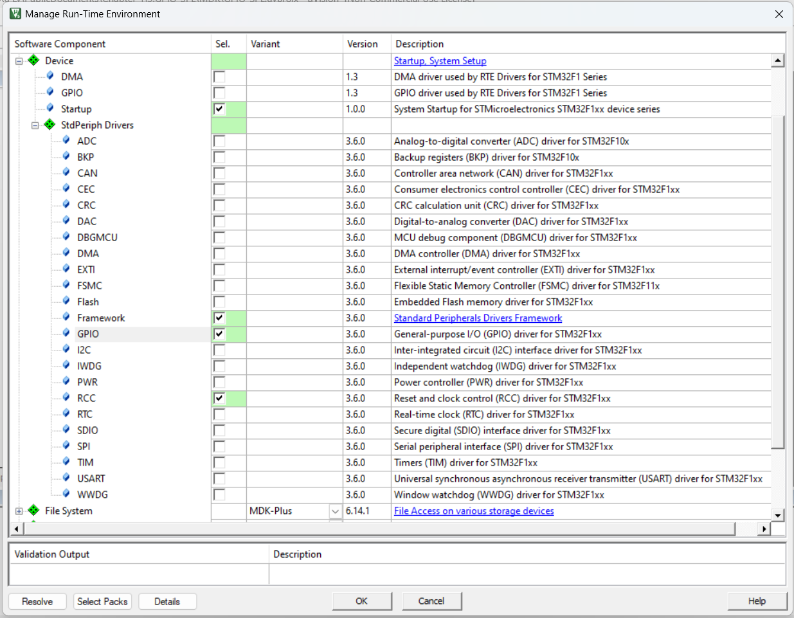
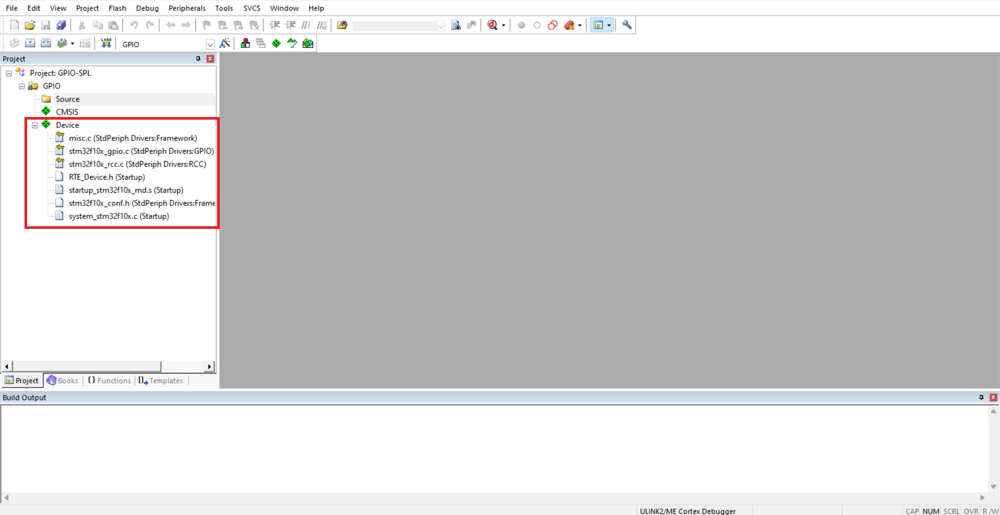

# LẬP TRÌNH GPIO SỬ DỤNG THANH GHI
## Giới thiệu lập trình sử dụng SPL
SPL (_Standard Peripherals Library_)/SPD (_Standard Peripherals Driver_) là bộ thư viện chuẩn hóa được sử dụng để hỗ trợ lập trình viên có thể tiếp cận nhanh với các ngoại vi thông qua các hàm đã được chuẩn hóa và có thể sử dụng trên nhiều dòng vi điều khiển thay vì phải tra Datasheet và User Manual rất kỹ như cách tiếp cận sử dụng các thanh ghi của vi điều khiển. Do đặc thù các MCU ngày càng phức tạp, việc tiếp cận thông qua các thư viện hỗ trợ ngoại vi theo kiểu SPL sẽ giúp cho quá trình phát triển và làm quen với các dòng vi điều khiển được nhanh hơn. Các bạn có thể tham khảo thêm các thư viện như [HAL](https://www.google.com/url?sa=t&rct=j&q=&esrc=s&source=web&cd=&cad=rja&uact=8&ved=2ahUKEwiR-oiT4cv6AhWURd4KHfRcDxkQFnoECBYQAQ&url=https%3A%2F%2Fwww.st.com%2Fresource%2Fen%2Fuser_manual%2Fdm00154093-description-of-stm32f1-hal-and-lowlayer-drivers-stmicroelectronics.pdf&usg=AOvVaw1cH2oa0f2-yv8NyT4_GyFv) hoặc một số thư viện khác.

Để lập trình GPIO với SPL cho STM32F1, cần sử dụng các gói sau:
- **Framework**: Khai báo sử dụng SPL trong dự án
- **RCC**: Điều khiển ngoại vi Control Clock của MCU
- **GPIO**: Điều khiển ngoại vi General Purpose Input Output 

Sau khi cấu hình xong, dự án có giao diện cơ bản như sau, trong đó các gói thư viện được lựa chọn từ SPL sẽ được tự động thêm vào dự án:

## Thử nghiệm
**Kết nối**:
- ***C13*** - LED 1
- ***B9*** - Button 1
- ***A0-A7*** - LED A (8 LED)
- ***A8-A15*** - Button A (8 Button)
- ***B0-B7*** - LED B (8 LED)

**Thử nghiệm**:
- Nhấn nút Button 1 và theo dõi hiện tượng ở LED 1
- Lần lượt hoặc nhấn đồng thời 1 số nút của Button A và xem hiện tượng ở LED A
- Theo dõi giá trị hiển thị trên LED B (Chú ý giá trị dưới dạng nhị phân)

**Giải thích:**
- Updating

**Mở rộng**:
- Hiệu chỉnh chương trình để tăng tốc độ đáp ứng từ khi nhấn nút đến khi đèn đáp ứng.
- Hiệu chỉnh chương trình đảo LED A thành A8-A15 và Button A thành A0-A7 sao cho việc sử dụng vẫn đáp ứng như cũ.
- LED B: Xây dựng hiệu ứng 1 đèn LED sáng chạy từ trái sang phải và ngược lại.