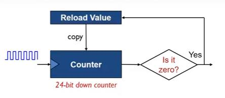

# Lập trình Systick
## Giới thiệu
Systick là một bộ đếm xuống 24 bit và có khả năng tự động nạp lại giá trị hoạt động độc lập và tự động. Systick được ví như một  đồng hồ đếm ngược, nó được tạo ra để cung cấp một bộ thời gian chuẩn cho hệ thống. Đồng hồ Systick được sử dụng để cung cấp một bộ đếm chuẩn cho hệ điều hành thời gian thực RTOS hoặc để tạo một ngắt có tính chu kì hay đơn giản để tạo một khoảng trễ (delay) có độ chính xác cao. Ở ví dụ này chúng ta tiếp cận delay để tạo ra một ngắt có tính chu kỳ sử dụng Systick kết hợp với Ngắt.


## Giải thích về ngắt
- Updating

## Giải thích
```C
SysTick_Config(SystemCoreClock/1000);
```
_SystemCoreClock_ là tần số xung nhịp của chip hay là số lần dao động trong 1 giây của nguồn dao động cung cấp cho MCU. Ở đây chúng ta gọi hàm _SysTick_Config_ để yêu cầu hệ thống định kỳ gọi một hàm ngắt (_SysTick_Handler_) mỗi khi bộ đếm đếm được một khoảng xung nhịp như yêu cầu, ở đây là _SystemCoreClock/1000_ tương đương với _1ms_. Nó tương đương với thiết bị đồng hồ quả lắc định kỳ 15 phút sẽ thực hiện kêu 1 tiếng chuông. Ở đây thay vì kêu chuông, vi điều khiển sẽ định kỳ 1ms gọi hàm _SysTick_Handler_ thông qua cơ chế ngắt.
Ở ví dụ này chúng ta thực hiện gán biến _systick_Flag_ lên 1 mỗi khi hàm _SysTick_Handler_ được gọi. Sau đó, trong hàm _main_ chương trình sẽ định kỳ kiểm tra: Nếu biến _systick_Flag_ bằng 1 thì sẽ tiến hành gọi hàm đảo trạng thái đèn LED đồng thời xóa _systick_Flag_ về 0 để chuẩn bị cho lần gọi hàm _SysTick_Handler_ kế tiếp. Nếu không xóa _systick_Flag_ về 0 thì điều kiện của vòng if luôn đúng do vậy đèn LED sẽ không nhấp nháy với chu kỳ mong muốn.

## Thử nghiệm:
- Dùng oscilloscope đo xung trên chân LED. Xác định chu kỳ LED nhấp nháy và quan hệ với tham số _SystemCoreClock/1000_ đã được cấu hình cho vi điều khiển.

## Mở rộng
- Bộ đếm Systick là 24 bit. Giải sử tần số xung nhịp là 72MHz. Vậy thời gian tối đa mà bộ đếm chứa được là bao nhiêu?
- Tìm phương án sửa code ví dụ để LED có thể nháy với tần số là 1Hz, 0.5Hz...
- Xây dựng chương trình nhấp nháy 3 LED với 3 tần số là 1Hz, 4Hz và 10Hz độc lập.