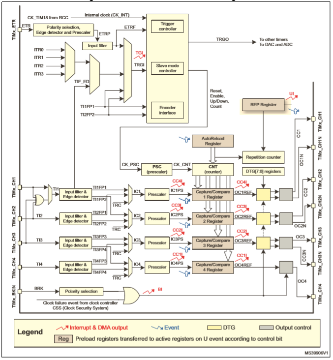
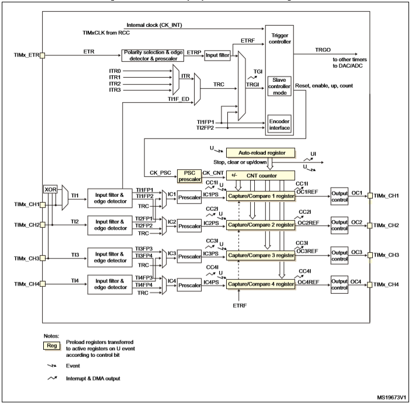

# Giới thiệu về bộ Timer

## Hoạt động cơ bản của bộ Timer

Một Timer cở bản gồm các thành phần như sau:
- ***TIM_CLK*** : clock cung cấp cho timer.
- ***PSC*** (Prescaler): là thanh ghi 16bits làm bộ chia cho timer, có thể chia từ 1 tới 65535
- ***ARR*** (Auto-Reload Register): là giá trị đếm của timer (16bits hoặc 32bits).
- ***RCR*** (Repetition Counter Register): giá trị đếm lặp lại 16bits

Timer của STM32 là timer 16 bits có thể tạo ra các sự kiện trong khoảng thời gian từ nano giây tới vài phút gọi là **UEV** (Update Event).
Giá trị của UEV được tính theo công thức sau:

$UEV = \dfrac{TIM\_CLK}{(PSC + 1) \times (ARR + 1) \times (RCR + 1)} (\mu s)$

## Bộ Timer Advanced-Control

Bộ Timer Advanced-Control bao gồm TIM1 và TIM8 đối với dòng vi điều khiển STM32F1. Các bộ timer này có một số đặc điểm như sau:
- Bộ đếm 16 bit có thể đếm tiến, lùi, tiến/lùi tự động nạp lại
- Hỗ trợ bộ chia tần 16 bit có thể lập trình được.
- Hỗ trợ 4 kênh hoạt động độc lập cho các chức năng:
    - Caputre đầu vào
    - So sánh đầu ra
    - Điều chế độ rộng xung (PWM)
    - Chế độ đầu ra một xung
- Hỗ trợ kích hoạt các sự kiến DMA
- Hỗ trợ kích hoạt ngắt
- Hỗ trợ trigger cho các sự kiện

## Bộ Timer General Purpose

Bộ Timer Advanced-Control bao gồm TIM2 đến TIM5 đối với dòng vi điều khiển STM32F1. Các bộ timer này có một số đặc điểm như sau:
- Bộ đếm 16 bit có thể đếm tiến, lùi, tiến/lùi tự động nạp lại
- Hỗ trợ bộ chia tần 16 bit có thể lập trình được.
- Hỗ trợ 4 kênh hoạt động độc lập cho các chức năng:
    - Caputre đầu vào
    - So sánh đầu ra
    - Điều chế độ rộng xung (PWM)
    - Chế độ đầu ra một xung
- Hỗ trợ kích hoạt các sự kiến DMA
- Hỗ trợ kích hoạt ngắt
- Hỗ trợ trigger cho các sự kiện
- Hỗ trợ đọc cảm biến hall 4 đầu vào

## Chương trình:
Để có thể sử dụng tính năng Timer, chúng ta cần lưu ý Enable tính năng **TIM** trong mục **StdPeriph Drivers** khi khởi tạo Project.
 
Ví dụ của phần này tạo ra 02 Timer hoạt động với 2 cấu hình khác nhau:
- 01 Timer hoạt động với cơ chế Đếm và Chờ.
- 01 Timer hoạt động với cơ chế [Ngắt](https://tapit.vn/qua-trinh-thuc-hien-ngat-cua-vi-dieu-khien-mcu-interrupt-processing/). (_Các bạn có thể tham khảo giải thích về ngắt ở tài liệu này_)
Sau mỗi sự kiện ngắt đèn LED sẽ được nháy. Để đo chính xác thời gian thực hiện Timer các bạn có thể sử dụng [Oscilloscope](https://vi.wikipedia.org/wiki/Dao_%C4%91%E1%BB%99ng_k%C3%BD) hoặc [Logic Analyzer](https://en.wikipedia.org/wiki/Logic_analyzer) để đo đạc chính xác khoảng thời gian mà Timer tạo ra.
Lưu ý: Trong một số trường hợp chúng ta cần tạo ra một Timer có khoảng thời gian lớn cần sử dụng phối hợp các thanh ghi đã nhắc đến ở trên để tạo ra giá trị phù hợp. Trong trường hợp thời gian cần cập nhật lớn hơn khoảng công thức ở trên đã đề cập chúng ta cần mở rộng với biến đếm để thu được khoảng thời gian phù hợp hơn.

## Thử nghiệm

## Mở rộng