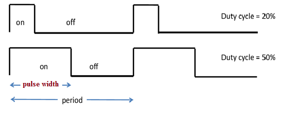
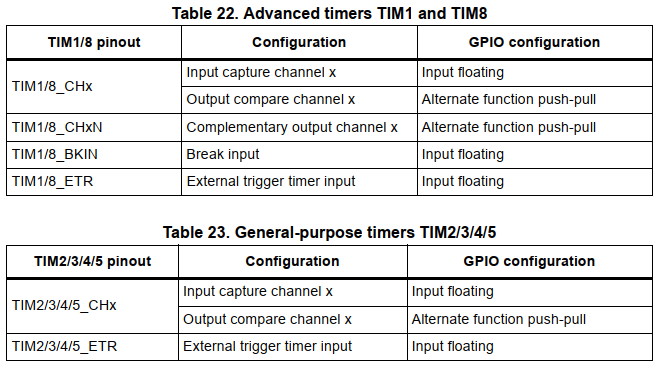

# Điều chế độ rộng xung - PWM (Pulse-Width Modulation)
## Giải thích

Bộ điều chế xung, hay còn gọi là bộ _“băm xung”_ là bộ xử lý và điều khiển tạo ra dạng xung vuông với chu kỳ và độ rộng thay đổi theo cấu hình. Đây là phương pháp điều chỉnh điện áp ra tải dựa vào trung bình tín hiệu điều chế. Khi độ rộng xung tăng, trung bình điện áp ra tăng. Các module PWM thường sử dụng tần số điều chế không đổi, và điều chỉnh dựa trên sự thay đổi của độ rộng xung _(Duty Cycle)_.
- Duty Cycle là tỷ lệ phần trăm thời gian mức cao so với toàn chu kỳ.
- Period: chu kỳ của xung là thời gian thực hiện xong 1 chu kỳ băm tín hiệu.
- Pulse Width là thời gian tín hiệu xuất ra ở mức cao.

## Cấu hình
PWM là một chức năng tích hợp của bộ Timer vì vậy để sử dụng PWM cần khai báo thư viện timer. Cụ thể là thư viện: _stm32f10x_tim.h_. Để sử dụng PWM trong Timer cần tìm hiểu 2 kiểu dử liệu dạng struct sau:
- ***TIM_TimeBaseInitTypeDef***: Khai báo thông tin hoạt động cơ bản của Timer
- ***TIM_OCInitTypeDef***: Khai báo thông tin hoạt động của bộ PWM

Đoạn chương trình nạp thông tin cấu hình cho bộ PWM bao gồm 2 đoạn: Cấu hình cho Timer điều khiển PWM và cấu hình cho hoạt động của bộ PWM. Mỗi Timer hỗ trợ 4 bộ PWM vì vậy tùy thuộc vào nhu cầu sử dụng mà người lập trình thiết lập và cấu hình số chân cần điều khiển phù hợp. Chương trình của ví dụ này được cho Timer 1 và thực hiện cấu hình cho cả 4 kênh PWM.

Ngoài ra, việc điều chế độ rộng xung cần thông qua các cổng của vi điều khiển và vi điều khiển STM32 có những yêu cầu đặc biệt về chế độ của cổng khi sử dụng với các bộ ngoại
vi bên trong. Cụ thể với Timer vi điều khiển yêu cầu thông tin cấu hình của các cổng tương ứng như sau:

PWM hoạt động dựa trên chế độ Output Compare Channel do vậy để các chân tương ứng hoạt động ở chế độ PWM cần cấu hình các chân đó ở chế độ hoạt động Alternate function push-pull.

## Thử nghiệm
- Thực hiện đo tín hiệu trên các chân A8, A9, A10, A11 bằng cách sử dụng Oscilloscope hoặc Logic Analyzer như đã giới thiệu ở ví dụ về [Timer](../6.1.Timer/README.md/#chương-trình)
    - Xác định Chu kỳ, Độ rộng xung
    - Giải thích quan hệ của các thông số cấu hình và các tham số đo được thực tế.

## Mở rộng:
- Thay đổi chu kỳ của tín hiệu PWM
- Bổ sung chương trình trong _while(1)_ thực hiện định kỳ thay đổi độ rộng xung tín hiệu trên các kênh.